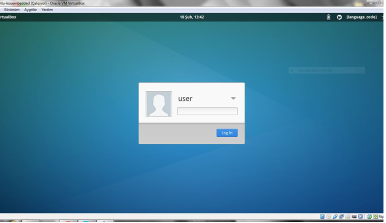

= 1-) Sanal Makine Kurulumu

.. *İçindekiler*
. Sanal Makine Kurulumu
.. Giriş
... Sanal Makine Programı
.... VirtualBox Sanal Makinesinin Kurulumu
... Sanal Makine Dosyası
.. Güvenlik Notları
.. İlk Çalıştırma
.. Sanal Makinenin Kullanımı

== 1.2. Giriş
Sistem Programlama için kullanılacak geliştirme ortamı kurulumu iki adıma ihtiyaç duymaktadır. + 

* Sanal Makine Programı(VirtualBox) +

* Sanal Makine Dosyasının Kurulumu(xubuntu-kouembedded-v20160217.ova) +

=== 1.2.1. Sanal Makine Programı

Sanal Makine programları gerçek bir bilgisayar gibi çalışan yazılımdır. Sanal Makine, işletim sistemi ile donanım arasında bir sanal ortam oluşturur. +

==== 1.2.1.1. VirtualBox Sanal Makinesinin Kurulumu

Sistem programlama dersi için hazırlanan geliştirme ortamı VirtualBox isimli bir sanal makine programı üzerinde çalışacaktır. VirtualBox sanal makine programı aşağıdaki linklerden indirilip kurulabilir. +

* Windows: http://download.virtualbox.org/virtualbox/4.3.40/VirtualBox-4.3.40-110317-Win.exe

* GNU/Linux: Yazılım merkezi kullanılarak indirilebilir. +

* OS X:http://download.virtualbox.org/virtualbox/4.3.40/VirtualBox-4.3.40-110317-OSX.dmg

VirtualBox kurulumu tamamlandıktan sonra programa ait birkaç özelliğin aktif hale gelmesi için aşağıdaki linkteki ek paketinde indirilip kurulması gerekmektedir. +

http:http://download.virtualbox.org/virtualbox/4.3.40/Oracle_VM_VirtualBox_Extension_Pack-4.3.40-110317a.vbox-extpack

=== 1.2.2. Sanal Makine Dosyası

Bilgisayar üzerinde sanal makine çalıştırmak için gerekli olan ikinci adım ise VirtualBox sanal makine programı içinde çalışacak *“ova”* uzantılı sanal makina kalıbının eklenmesidir. +

2017 Bahar yarıyılı Sistem programlama dersi için kullanılacak sanal makine kalıbını ismi *“xubuntu-kouembedded-v20160217.ova”* dır. Bu sanal makine kalıbı gömülü sistem lab. tarfından sistem programlama dersi için hazırlanmış olup hiçbir lisans kısıtlaması mevcut değildir. Dolayısıyla kalıp istenildiği takdirde internet üzerinden paylaşılabilir. +

Derse ait *“xubuntu-kouembedded-v20160217.ova”* isimli sanal makine programına aşağıdaki linklerden erişebilirsiniz. +

* https://github.com/KOU-Embedded-System-Lab/os-base-image/releases/download/v20160217/xubuntu-kouembedded-v20160217.ova

* https://github.com/KOU-Embedded-System-Lab/os-base-image/releases

== 1.3. Güvenlik Notları

* Sanal makinede resmi olarak desteklenmeyen, değiştirilmiş bir GNU/Linux dağıtımı bulunmaktadır. İşletim sisteminde laboratuvar tarafından ders için değişiklik yapılmıştır ve gerektiğinde ders ile ilgili güncelleme verilecektir. +

* Sanal makineye tarafımızca güvenlik garantisi verilmemektedir. Ders amacı dışında kullanmanız tavsiye edilmez. Sanal makine içindeki yazılımlara kişisel bilgi ve parola (mail vb.) girmeyiniz. +

* Güvenmediğiniz bir kaynaktan aldığınız sanal makine dosyasını sha1sum kontrolünü yaparak kullanmanız tavsiye edilir. +

*sha1sum:* 6c89fb4c637c1c965331b52dcdac922f9a32c0eb
xubuntu-kouembedded-v20160217.ova 496751616 byte

== 1.4. İlk Çalıştırma

VirtualBox programını açıyoruz +

image::https://github.com/bahadirturkoglu/deneme.adoc/raw/master/Capturef1.PNG[R]

Dosya menüsünden *“Cihazı içe aktar”* seçeneğini tıklayın. +

image::Capturef2.PNG[R]

Kırmızı ile işaretli seçeneğini tıklayıp sanal makine dosyasını (xubuntu-kouembedded-v20160217.ova) seçiniz.
Ardından *“ileri”* ye basınız. +

Makinenizin özeliklerine göre sanal makineye paylaşacağınız CPU (çekirdek) sayısı ve RAM miktarını değiştirebilirsiniz.
Ardından *“İçe aktar”* a tıklayınız. +

İşlemin tamamlanmasını bekleyin. İşlem biraz uzun sürebilir. +

== 1.5. Sanal Makinenin Kullanımı

Virtualbox programını açtığınızda aşağıdaki pencere gelecektir.

*“Başlat”* buttonu ile makineyi başlatın. Makine açıldığında aşağıdaki pencere gelecektir. +

*Dikkat:* Sistem açılması uzun sürebilir, kullanıcı giriş ekranı gelene kadar belli bir süre beklemeniz gerekebilir. +

*Not:* 5 dakika geçtikten sonra siyah ekranda kalma durumunda veya açılma sırasında bir hata mesajı ile karşılaşılması durumunda “Kurulum Problemleri” dokümanını inceleyiniz. +

kullanıcı adı = *user* ve parola = *1 tane boşluk karakteri (space)*

