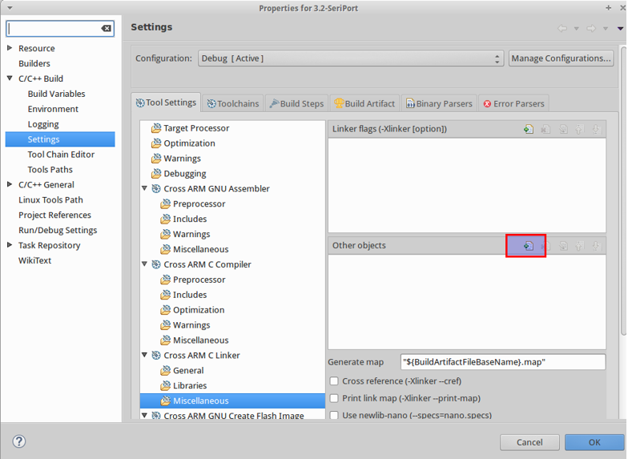
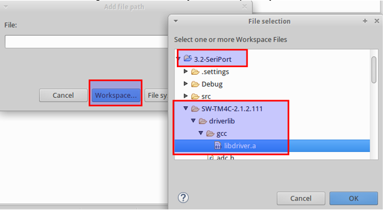

= Hazır Fonksiyonları Kullanmak İçin Proje Ayarları

Proje isminde sağa tıklayarak açılan bölümde *“Properties”*e tıklayınız. +

Açılan menüden C/C++ Build -> Settings menüsünü açınız. Aşağıdaki şekildeki gibi *“Cross ARM C Linker”*  altından *“Miscellaneous”*’u açınız. +
*“Other objects”* kısmındaki ekleme buttonuna tıklayınız. +

