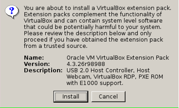
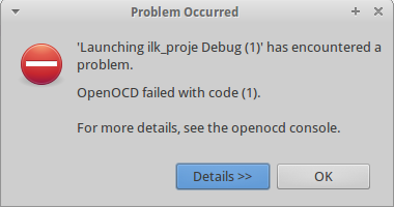
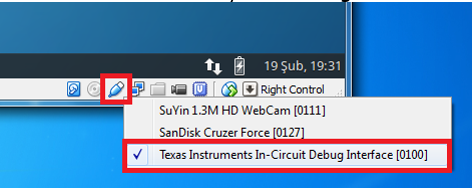
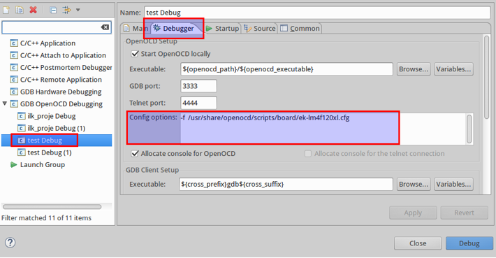
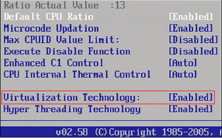
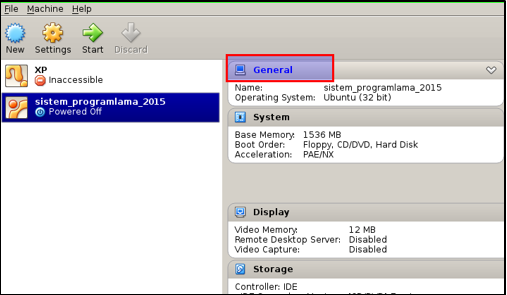
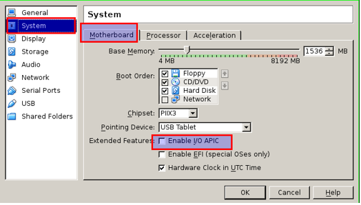
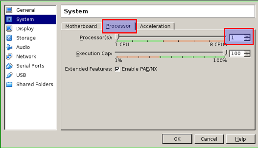

= 1-) İçindekiler

. USB Tanımama Problemi
. Debugger”ın çalışmaması2. “Debugger”ın çalışmaması2. “Debugger”ın çalışmaması
. Sanal makinenin açılmama problemi veya "tsc: Fast TSC calibration failed" hatası

== 1. USB Tanımama Problemi

Sanal makinenin USB’yi tanımaması durumunda *“Oracle VM VirtualBox Extension Pack”* paketinin kurulması gerekmektedir. + 

Kurulumu ders notlarındaki *“1-Sanal Makine Kurulumu”* dokümanına göre yaptıysanız aşağıdaki linkten indirebilirsiniz:
http://download.virtualbox.org/virtualbox/4.3.36/Oracle_VM_VirtualBox_Extension_Pack-4.3.36-105129.vbox-extpack/

Eğer kurulumu farklı bir şekilde yaptıysanız www.virtualbox.org sayfasından kullanıdığınız virtualbox versiyonuna uygun *“Oracle VM VirtualBox Extension Pack”* paketini indiriniz. +

İndirdiğiniz dosyayı çift tıklayarak kurulumu gerçekleştirebilirsiniz. +

== 2. “Debugger”ın çalışmaması

1. Kartın sanal makineye aktarıldığını kontrol edin

2. Debug ayarlarında “Config options” ayarını kontrol edin.

*UYARI:* Google Drive’dan kopyalama sırasında görünmeyen karakter gelebilir. Config options ayarındaki yazıyı şu linkten txt dosyasını indirip kopyalayabilirsiniz: +
https://drive.google.com/file/d/0Bw8VB6WrbOkiVWtUb3BSTGhaM28/view?usp=sharing/

== Sanal makinenin açılmama problemi veya "tsc: Fast TSC calibration failed" hatası

Bu hatanın birden fazla sebebi olabilir. Seçenekleri çözüme ulaşana kadar aşağıdaki sırayla tek tek deneyiniz. +

1. İşlemcinizin sanallaştırma (virtualization) özelliğini aktifleştirin. +
BIOS’tan aşağıdaki gibi bir ayarı etkinleştirmelisiniz. Bu ayar BIOS’unuzun modeline göre farklı bir isimle olabilir. +

2. Bilgisayarınızda başka sanal makine kurulu ise (VMware, Hyper-V), VirtualBox kullanırken diğerini devre dışı bırakmalısınız. İki sanal makine programı aynı anda çalışamaz. +

3. İşlemcinizde sanallaştırma desteği yoksa (Atom / Celeron işlemcilerin bazılarında) +

*"General"* kısmındaki yazıyı tıklayın. +

*"System"* altından "Motherboard" kısmında "Enable I/O APIC" özelliğini kapatın +

Processor kısmından çekirdek sayısını 1 yapın. +

