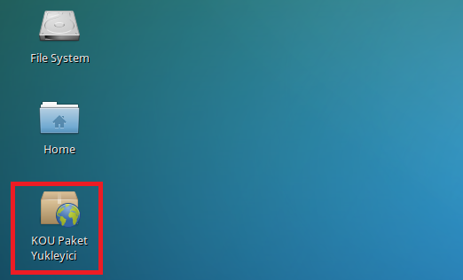

=  1-) Sistem Programlama Dersine Yönelik Program Kurulumu

 İçindekiler 

. Sistem programlama dersine yönelik program kurulumu 
. İçindekiler
.. Giriş
... KOU Paket Yükleyici Programı

*Giriş* +
Sistem Programlama için kullanılacak geliştirme programlarının kurulumu ve ayarlananması anlatılacaktır.

*KOU Paket Yükleyici Programı*

VirtualBox ‘ın içine “xubuntu-kouembedded-v20160217.ova” isimli sanal makine kalıbı aktarıldıktan sonra masaüstünde KOU Paket Yükleyici isimli bir program görünecektir. 

Masaüstündeki”Kou Paket Yükleyici”ye tıklayınız. +

”Sistem Programlama Programları”nı seçiniz ve “Kaydet”e tıklıyanız. +

“Yes”e tıklayınız.

image::resim1.2.3.png[R]

password = 1 tane boşluk karakteri (space) +

İşlemin tamamlanmasını bekleyiniz. İşlem biraz uzun sürebilir. +

İşlem tamamlandı pencereyi kapatınız. +

“Başlat” menüsünden “Development” menüsü altındaki  “KOU Eclipse” tıklayınız. +

“password” = 1 tane boşluk karakteri (space)

image::resim1.2.9.png.jpg[R]

İşlemin tamamlanmasını bekleyiniz. İşlem biraz uzun sürebilir.

Kurulum bittikten sonra “Başlat” menüsünden “Development” menüsü altındaki  “KOU Eclipse” tıklayınız. +

Herhangi bir seçim yapmadan “OK”e basınız. +

Programımız kullanıma hazır hale gelmiştir. +

  

