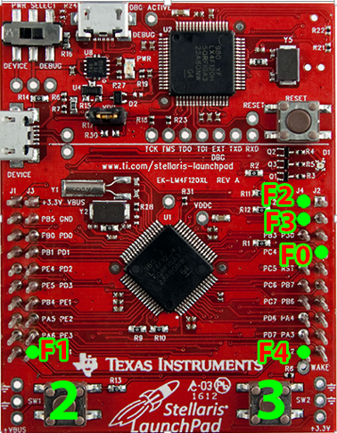
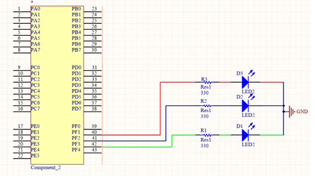
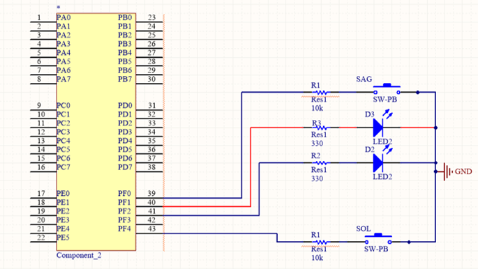

= Kartın Üzerindeki LED ve Buttonlar

Stellaris Launchpad üzerinde 2 button(reset butonu hariç) ve 3 led bulunur. Bu led ve butonlar  PORT F’ye bağlıdır. PORT F’deki yerleşimleri aşağıdaki gibidir:
Şekil 1’de *2* ve *3* numara Stellaris kartının üzerindeki butonları, *Yeşil noktalar*  ise PORTF’nin pinlerini göstermektedir. +

* Port F0 : SW2 (Sağdaki button) +
* Port F4 : SW1 (Soldaki button) +
* Port F1 : Kırmızı LED +
* Port F2 : Mavi LED +
* Port F3 : Yeşil LED +

Bu Led ve butonları kullanabilmek için yönlerinin belirlenmesi gerekir. Yön seçimi işleminde butonlar giriş, LEDler çıkış olarak ayarlanır. + 
*Çıkış* olarak ayarlamak için *1 biti* kullanılır. +
*Giriş* olarak ayarlamak için *0 biti* kullanılır. +
Ayarlarda PortF yön registerına (GPIO_PORTF_DIR_R) bu değerleri aşağıdaki gibi yazılır. +
*GPIO_PORTF_DIR_R = 0b01110;* // 0. Ve 4. Bit giriş, 1. 2. Ve 3. Bitler çıkış olarak ayarlandı +
Porta veri yazma ve okuma işlemi PortF data register (GPIO_PORTF_DATA_R) üzerinden yapılır. 5 ayrı eleman aynı register üzerinde olduğu için, okunan değerin bit işlemlerine ayrılması gerekmektedir. 

*Örnek:* PortF’nin 4. bitini okumak için aşağıdaki işlem yapılmalıdır. +
*GPIO_PORTF_DATA_R & 0b10000* +
Porttaki tüm bitleri oku ve 10000 ile AND yaparak sadece 4. biti al. +
*Örnek:* PortF’nin 2. bitini 1 yapmak için aşağıdaki işlem yapılmalıdır. +
*GPIO_PORTF_DATA_R = GPIO_PORTF_DATA_R | 0b00100* +
Porttaki tüm bitleri oku. 00100 ile OR’layıp 2. biti 1 yap. Geri ata. +
*Örnek:* PortF’nin 1. bitini 0 yapmak için aşağıdaki işlem yapılmalıdır: +
*GPIO_PORTF_DATA_R = GPIO_PORTF_DATA_R & ~(0b00010)* +
Porttaki tüm bitleri oku ve 00010’in tersi ile AND’leyip sadece 1. biti 0 yap. Geri ata. +

Portların ayarlarına ve kullanım biçimine aşağıdaki linkten bakabilirsiniz: +
http://users.ece.utexas.edu/~valvano/Volume1/E-Book/C6_MicrocontrollerPorts.htm#6_3/ +
 *“6.3. I/O Programming and the Direction Register”* başlığı altındaki *“Interactive Tool 6.1”* kısmından inceleyebilirsiniz. +
 
= LED yakip söndürme örneği
Bu örnek çalıştırıldığında kırmızı led yanacak biraz bekledikten sonra sönecek, biraz bekledikten sonra da mavi led yanacak ve biraz  bekledikten sonra mavi led de sönecek ve biraz bekleyecek. Bu sonsuz döngü içinde tekrarlanacak. +

[source,c]
---------------------------------------------------------------------

#include <stdint.h>
#include "inc/tm4c123gh6pm.h"

// stellaris #include "inc/lm4f120h5qr.h"

/**Bu fonksiyon portf’ye erişip müdahale edebilmemiz için gerekli ayarları yapıyor.*/
void init_port_F() {
   volatile unsigned long tmp; // bu degisken gecikme yapmak icin gerekli
   SYSCTL_RCGCGPIO_R |= 0x00000020;  // 1) activate clock for Port F
   tmp = SYSCTL_RCGCGPIO_R;    	// allow time for clock to start
   GPIO_PORTF_LOCK_R = 0x4C4F434B;   // 2) unlock GPIO Port F
   GPIO_PORTF_CR_R = 0x1F;       	// allow changes to PF4-0
   // only PF0 needs to be unlocked, other bits can't be locked
   GPIO_PORTF_AMSEL_R = 0x00;    	// 3) disable analog on PF
   GPIO_PORTF_PCTL_R = 0x00000000;   // 4) PCTL GPIO on PF4-0
   GPIO_PORTF_DIR_R = 0x0E;      	// 5) PF4,PF0 in, PF3-1 out
   GPIO_PORTF_AFSEL_R = 0x00;    	// 6) disable alt funct on PF7-0
   GPIO_PORTF_PUR_R = 0x11;      	// enable pull-up on PF0 and PF4
   GPIO_PORTF_DEN_R = 0x1F;      	// 7) enable digital I/O on PF4-0
}

int main(void) {
   init_port_F();// portf’yi ayarla

   volatile unsigned long delay; // compiler optimizasyonunu engellemek icin volatile kullandik

   while (1) {

  	 // kirmizi ledi yak
  	 GPIO_PORTF_DATA_R |= 0b00010; // 0x02

  	 for (delay = 0; delay < 400000; delay++)
  		 /* bos dongu ile bekle */;

  	 // kirmizi ledi sondur
  	 GPIO_PORTF_DATA_R &= ~0b00010;

  	 for (delay = 0; delay < 400000; delay++)
  		 /* bos dongu ile bekle */;

  	 // mavi ledi yak
  	 GPIO_PORTF_DATA_R |= 0b00100; // 0x04

  	 for (delay = 0; delay < 400000; delay++)
  		 /* bos dongu ile bekle */;

  	 // mavi ledi sondur
  	 GPIO_PORTF_DATA_R &= ~0b00100;

  	 for (delay = 0; delay < 400000; delay++)
  		 /* bos dongu ile bekle */;

   }
}

---------------------------------------------------------------------

= Buttonu kullanarak LED yakma örneği

Bu örnek çalıştırldığında soldaki butona basıldığında yeşil led yanacak, sağdaki butona basıldığında kırmızı led yanacak. +

[source,c]

---------------------------------------------------------------------

#include <stdint.h>
#include "inc/tm4c123gh6pm.h"

// stellaris #include "inc/lm4f120h5qr.h"

/**Bu fonksiyon portf’ye erişip müdahale edebilmemiz için gerekli ayarları yapıyor.*/
void init_port_F() {
   volatile unsigned long tmp; // bu degisken gecikme yapmak icin gerekli
   SYSCTL_RCGCGPIO_R |= 0x00000020;  // 1) activate clock for Port F
   tmp = SYSCTL_RCGCGPIO_R;    	// allow time for clock to start
   GPIO_PORTF_LOCK_R = 0x4C4F434B;   // 2) unlock GPIO Port F
   GPIO_PORTF_CR_R = 0x1F;       	// allow changes to PF4-0
   // only PF0 needs to be unlocked, other bits can't be locked
   GPIO_PORTF_AMSEL_R = 0x00;    	// 3) disable analog on PF
   GPIO_PORTF_PCTL_R = 0x00000000;   // 4) PCTL GPIO on PF4-0
   GPIO_PORTF_DIR_R = 0x0E;      	// 5) PF4,PF0 in, PF3-1 out
   GPIO_PORTF_AFSEL_R = 0x00;    	// 6) disable alt funct on PF7-0
   GPIO_PORTF_PUR_R = 0x11;      	// enable pull-up on PF0 and PF4
   GPIO_PORTF_DEN_R = 0x1F;      	// 7) enable digital I/O on PF4-0
}
int main(void) {
   init_port_F(); // portf’yi ayarla
   volatile unsigned long delay; // compiler optimizasyonunu engellemek icin volatile kullandik
   int button_sag, button_sol;
   while (1) {
  	 // sagdaki button 0. bit, soldaki button 4. bit
  	 // button basiliyken 0, basili degilken 1 değerini alır.
  	
 // sagdaki buttonun degerini oku, degiskene degerini ata
  	 button_sag = GPIO_PORTF_DATA_R & 0b00001;
  	
 // soldaki buttonun degerini oku, degiskene degerini ata
  	 button_sol = GPIO_PORTF_DATA_R & 0b10000;
  	 
if (button_sag == 0) {
  		 // kirmizi ledi yak
  		 GPIO_PORTF_DATA_R |= 0b00010; // 0x02
  	 } else {
  		 // button basili degilse, kirimzi ledi sondur
  		 GPIO_PORTF_DATA_R &= ~(0b00010);
  	 }
  	 if (button_sol == 0) { // button basili ise yesil ledi yak
  		 GPIO_PORTF_DATA_R |= 0x08; // 0b01000
  	 } else { // button basili degilse yeşil ledi sondur
  		 GPIO_PORTF_DATA_R &= ~(0x08);
  	 }
   }
}

---------------------------------------------------------------------

