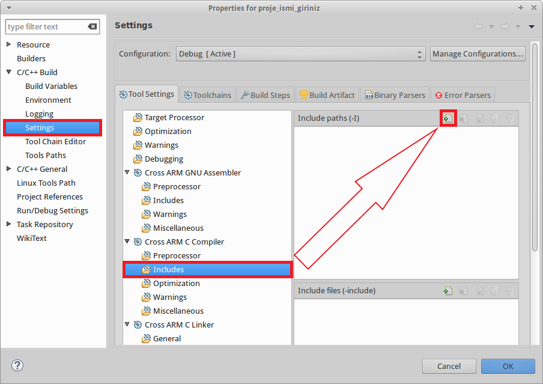
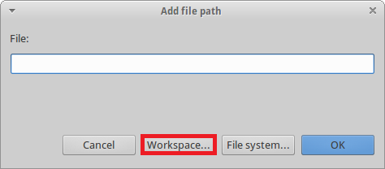
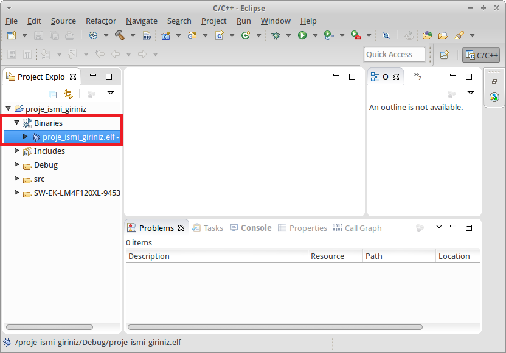

= Sistem programlama dersine yönelik proje oluşturma, derleme, programı karta aktarma ve hata ayıklama +

. İçindekiler 
.. Sistem programlama dersine yönelik proje oluşturma, derleme, programı karta aktarma ve hata ayıklama
.. İçindekiler
... Gerekli Dosyalar
... Proje açma
.... Eclipse geliştirme ortamında proje oluşturma
.... Dosyaların projeye kopyalanması
.... Proje ayarları
... Projeyi derleme
... “Debugger”ın ayarlanması
... Kartın sanal makineye aktarılması
... Debug işlemi

== 1.2.Gerekli Dosyalar
** Stellaris Launchpad kullananlar için: Stellaris_Launchpad.tar.gz +
https://drive.google.com/file/d/0Bw8VB6WrbOkiSmptUHhGYVAwMzg/view?usp=sharing/

** Tiva C Launch kullananlar için : Tiva_C_Launchpad.tar.gz +
https://drive.google.com/file/d/0Bw8VB6WrbOkiYWFnX0hqWl9HbWM/view?usp=sharing/

== 1.3. Proje açma

Eclipse geliştirme ortamında kartımız için proje oluşturma anlatılmıştır +
=== 1.3.1Eclipse geliştirme ortamında proje oluşturma

“KOU Eclipse”i açınız.

File menüsünden “New” -> “*Project*” seçeneğini tıklayınız. +

C/C++ altından C Project seçeneğini seçiniz +

image::resim1.2.png[R]

Proje ismi giriniz. Ardınan proje seçeneklerini aşağıdaki resimdeki ile aynı şekilde seçip Next’e basınız. +

Bir değişiklik yapmadan “Next”e basınız. +

image::resim1.4.png[R]

“Finish”e basınız. +

image::resim1.5.png[R]

Proje geliştirme ortamına geçmeniz için işaretlenmiş alana tıklayınız. +

=== 1.3.2. Dosyaların projeye kopyalanması

Ana makineden sanal makineye sürükle-bırak özelliğini aktifleştirmek için “Aygıtlar” bölümünden resimde gösterilen adımları uygulayınız. +

image::resim1.7.png[R]

İndirilmiş olan kütüphane arşivini aktarmak için ana makineden sanal makinenin masaüstündeki herhangi boş bir alana sürükleyiniz. +

image::resim1.8.jpg[R]

*Uyarı*: Stellaris kartını kullanıyorsanız “Stellaris_Launchpad.tar.gz”, Tiva C kartını kullanıyorsanız “Tiva_C_Launchpad.tar.gz” isimli dosyayı kullanmalısınız +

Ana makineden sanal makineye atılan arşivdeki dosyaları resimdeki gibi çıkartınız. +

Arşivden çıkartılmış olan klasörü açınız ve içindeki 2 klasörü daha önceden oluşturduğumuz projenin üstüne sürükleyip bırakınız. (Veya sağ tıklayıp kopyalayıp, Eclipse içinde proje ismine sağ tıklayıp yapıştıra basınız) +

Karşınıza çıkan kopyalama penceresinde “*OK*” butonuna basınız. +

=== 1.3.3. Proje ayarları

Proje isminde sağa tıklayarak açılan bölümde “Properties”e tıklayınız. +

Açılan pencerede gerekli düzenlemeleri yapınız. +

*DİKKAT: Düzenlemeler bitene kadar “OK” butonuna basmayınız.*

“*Cross ARM C*” compiler altından “*Includes*”i açınız +

*Uyarı*: Eğer Tiva C kartını kullanıyorsanız klasörün ismi “*SW-TM4C-2.1.2.111*” şeklinde görünecektir. +

“*Cross Arm C Linker*” altından “General”i ve kırmızı ile açınız. +

*Uyarı*:  Tiva C kartını kullanıyorsanız dosyanın ismi TM4C.ld şeklinde görünecektir. +

== 1.4. Projeyi derleme

Projeyi seçiniz ve “*Build*” ikonuna tıklayınız. (Veya projeyi sağ tıklayıp “Build Project”e tıklayınız) +

Proje derlendikten sonra “*Binaries*”in altında projeye ait çalıştırılabilir dosya oluşacaktır. +

== 1.5. “Debugger”ın ayarlanması 

Debug ikonunun yanındaki aşağı oka tıklayıp “*Debug Configurations*”u açınız. + 
(Veya proje ismine sağ tıklayıp “Debug As” menüsü altından “Debug Configurations”a tıklayınız) +

Soldaki menüden “*GDB OpenOCD Debugging*” seçeneğini çift tıklayınız. +

Debugger menüsünü açınız.

“*Config options*” alanına yazacağınız ifadeyi şu linkten kopyalayabilirsiniz: +

https://drive.google.com/file/d/0Bw8VB6WrbOkiVWtUb3BSTGhaM28/view?usp=sharing/

Ardından “*Apply*” buttonuna bastıktan sonra pencereyi kapatınız. +

== 1.6. Kartın sanal makineye aktarılması

Öncelikle geliştirme kartını USB bağlantısı ile bilgisayarınıza bağlayınız. +

USB  kablosunu  şekilde sarı renkle işaretlenmiş  “*USB  ICDI*”  yazan  kısma  bağlayınız. +

“*Power  selection*” yazan  kısımdaki  switch’in  “*debug*”  yazan  tarafta  olduğundan  emin  olun. +

Çalıştığında üst tarafta yeşil ledin yandığını göreceksiniz. +

Ardınan USB bağlantısını aşağıdaki gibi sanal makineye aktarınız. +

Sanal  makine  penceresinin  altından  USB  simgesine  sağ  tıklayıp,  “*Texas  Instruments In­Circuit ...*” aygıtını seçili yapın. +

*NOT*: Eğer bu işlemde USB aygıtın ismini görüp seçemiyorsanız (gri görünüyorsa) veya hiçbir USB aygıt görünmüyorsa “*Kurulum Problemleri*” dokümanına bakınız +

== 1.7. Debug işlemi
 
Aşağıdaki gibi  kırmızı ile işaretli olan  debug seçeneğini çalıştırın. +

Eğer  debug  menüsünde  görünmüyorsa “*1.4. Debugger”ın ayarlanması*” başlığındaki gibi  “*Debug Configurations*”u açıp, proje ile ilgili olan seçeneği seçip Debug buttonuna basınız.

Bu adımdan sonra kart üzerinde ledin yanıp söndüğünü göreceksiniz. +

“*Debug*” ın durdurulması
 

Açık unutulmuş “*Debug*”ların durdurulması +

Programın  tekrar  çalıştırılması  için,  önceki  çalışmadan  kalan  debuggerın  durdurulması  gerekmektedir.  Program  durdurulmadan  başka bir program debug edilmeye çalışıldığında aşağıdaki hata mesajı ile karşılaşılabilir. +

Bu durumda açık kalmış debuggerın durdurulması gerekmektedir. +

