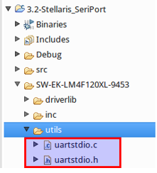
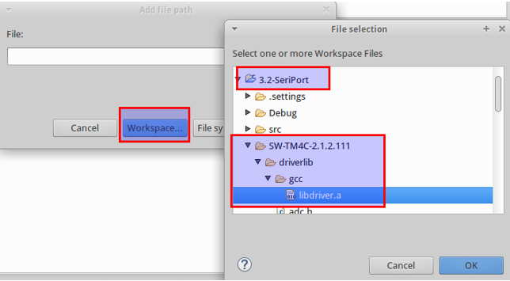

= ÖNEMLİ: Proje Dosyası Güncellemesi

07.03.2016 tarihinde hazır proje dosyalarında (Stellaris_Launchpad.tar.gz ve Tiva_C_Launchpad.tar.gz) güncelleme yapılmıştır. 
Son güncellemeyle proje klasörü altında utils/uartstdio.c ve utils/uartstdio.h dosyaları eklenmiştir. 

Eğer projenizde bu dosyalar bulunmuyorsa, hazır proje dosyalarının yeni versiyonunu “01-Gelistirme_Ortami/proje_dosyalari” altindan indirebilirsiniz.

Güncelleme için: +

* yeni indirdiğiniz dosya ile yeni proje açabilirsiniz +
* veya hazır projeye sadece utils klasörünü yukarıdaki resimdeki gibi ekleyebilirsiniz +

Eğer projenizde bu dosyalar bulunmuyorsa, hazır proje dosyalarının yeni versiyonunu “01-Gelistirme_Ortami/proje_dosyalari” altindan indirebilirsiniz. +

Güncelleme için: + 

* yeni indirdiğiniz dosya ile yeni proje açabilirsiniz +
* veya hazır projeye sadece utils klasörünü yukarıdaki resimdeki gibi ekleyebilirsiniz +

= ÖNEMLİ: Proje Ayarları Güncellemesi

Proje isminde sağa tıklayarak açılan bölümde *“Properties”* e tıklayınız.

Açılan menüden C/C++ Build -> Settings menüsünü açınız. Aşağıdaki şekildeki gibi *“Cross ARM C Linker”*  altından *“Miscellaneous”*’u açınız. *“Other objects”* kısmındaki ekleme buttonuna tıklayınız. +

image::Capture13.PNG[R]

Açılan pencereden *“Workspace”* buttonuna tıklayıp, aşağıdaki resimdeki gibi açık olan projeniz altından *“...driverlib/gcc/libdriver.a”* dosyasını bulup ekleyiniz. +

= Seri porttan bilgisayara text gönderme ve okuma
Seri portu şimdilik log atmak için kullanacağımız için fazla detaya girmiyoruz. Aşağıdaki kod ile bilgisayara yazı gönderebilirsiniz. +

