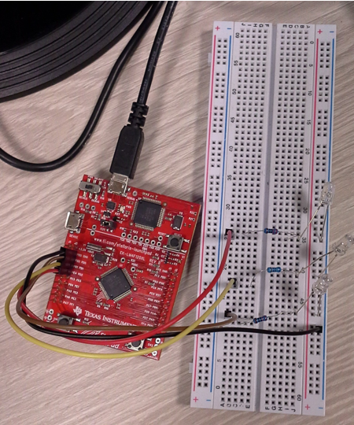
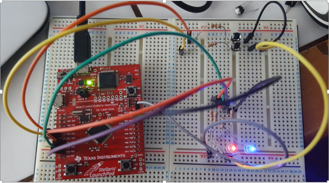
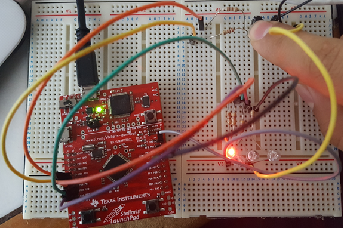

= Port D’nin dışarıdan led bağlanarak kullanılması

PD0 ve PD1’e birer led bağlı. +

[source,c]
---------------------------------------------------------------------

#include <stdint.h>
#include "inc/tm4c123gh6pm.h"
// stellaris #include "inc/lm4f120h5qr.h"

void init_port_D() {
	volatile unsigned long delay;
	SYSCTL_RCGC2_R |= SYSCTL_RCGC2_GPIOD; // Port D’yi aktiflestir
	delay = SYSCTL_RCGC2_R;  	// zaman gecirmek icin
	GPIO_PORTD_DIR_R |= 0x0F;	// PD 3,2,1,0 pinlerini cikis yap
	GPIO_PORTD_AFSEL_R &= ~0x0F; // PD 3,2,1,0 pinlerini alternatif fonksinunu 0 yap
	GPIO_PORTD_DEN_R |= 0x0F;	// PD 3,2,1,0 pinlerini aktiflestir
}

int main() {
	volatile unsigned long delay;

	init_port_D();

	while (1) {
   	GPIO_PORTD_DATA_R |= 0b0010; // PD1’i 1 yap
   	GPIO_PORTD_DATA_R &= ~0b0001; // PD0’i 0 yap

   	for (delay = 0 ; delay < 400000 ; delay++)
       		/* bos dongu */;

   	GPIO_PORTD_DATA_R |= 0b0001; // PD0’i 1 yap
   	GPIO_PORTD_DATA_R &= ~0b0010; // PD1’i 0 yap

   	for (delay = 0 ; delay < 400000 ; delay++)
       		/* bos dongu */;
	}
}

---------------------------------------------------------------------

= 3 Led ile Trafik Işığı

PD0’e kırmızı, PD1’e sarı (şekilde mavi led), PD2’ye yeşil led bağlı. +

[source,c]
---------------------------------------------------------------------

#include <stdint.h>
#include "inc/tm4c123gh6pm.h"
// stellaris #include "inc/lm4f120h5qr.h"

void init_port_D() {
	volatile unsigned long delay;
	SYSCTL_RCGC2_R |= SYSCTL_RCGC2_GPIOD; // Port D’yi aktiflestir
	delay = SYSCTL_RCGC2_R;  	// zaman gecirmek icin
	GPIO_PORTD_DIR_R |= 0x0F;	// PD 3,2,1,0 pinlerini cikis yap
	GPIO_PORTD_AFSEL_R &= ~0x0F; // PD 3,2,1,0 pinlerini alternatif fonksinunu 0 yap
	GPIO_PORTD_DEN_R |= 0x0F;	// PD 3,2,1,0 pinlerini aktiflestir
}

#define BIT_SET(PORT, PIN) do { \
	PORT |= 1<<PIN; \
} while (0)

#define BIT_RESET(PORT, PIN) do { \
	PORT &= ~(1<<PIN); \
} while (0)

#define PORTD (GPIO_PORTD_DATA_R)

int main() {
	volatile unsigned long delay;

	init_port_D();

	while (1) {
  	// KIRMIZI=1, SARI=0, YESIL=0
  	BIT_SET(PORTD, 1);
   	BIT_RESET(PORTD, 2);
   	BIT_RESET(PORTD, 3);
   	for (delay = 0 ; delay < 4000000 ; delay++)
  		 /* bos dongu */;

   	// KIRMIZI=1, SARI=1, YESIL=0
  	BIT_SET(PORTD, 1);
   	BIT_SET(PORTD, 2);
   	BIT_RESET(PORTD, 3);
  	for (delay = 0 ; delay < 4000000 ; delay++)
  		 /* bos dongu */;

  	// KIRMIZI=0, SARI=0, YESIL=1
  	BIT_RESET(PORTD, 1);
   	BIT_RESET(PORTD, 2);
   	BIT_SET(PORTD, 3);
  	for (delay = 0 ; delay < 4000000 ; delay++)
  		 /* bos dongu */;

  	// SARI
  	BIT_RESET(PORTD, 1);
   	BIT_SET(PORTD, 2);
   	BIT_RESET(PORTD, 3);
  	 for (delay = 0 ; delay < 4000000 ; delay++)
  		 /* bos dongu */;

	}
}

---------------------------------------------------------------------

image::Capture5.PNG[R]

= PORTE’ye Dışardan Buton Bağlama

[source,c]

---------------------------------------------------------------------

#include <stdint.h>	
#include "inc/tm4c123gh6pm.h"
/**Bu fonksiyon portE’ye erişip müdahale edebilmemiz için gerekli ayarları yapıyor.*/
void init_port_E() {
   volatile unsigned long tmp; // bu degisken gecikme yapmak icin gerekli
   SYSCTL_RCGC2_R |= SYSCTL_RCGC2_GPIOE;   // 1) E portunun osilatörünü etkinleştir
   tmp = SYSCTL_RCGCGPIO_R;    	// allow time for clock to start
   GPIO_PORTE_LOCK_R = 0x4C4F434B;   // 2) unlock GPIO Port E
   GPIO_PORTE_CR_R = 0x3F;         // allow changes to PE5-0 //PE5-0 değişikliklerine izin ver
                                   // only PE0 needs to be unlocked, other bits can't be locked
    			 // Sadece PE0 kilidinin açılması gerekir, diğer bitler kilitlenemez
   GPIO_PORTE_AMSEL_R = 0x00;    	// 3) disable analog on PE //PE'de analog devre dışı bırak
   GPIO_PORTE_PCTL_R = 0x00000000;   // 4) PCTL GPIO on PE4-0
   GPIO_PORTE_DIR_R = 0x0F;      	// 5) PE4,PE5 in, PE3-0 out
   GPIO_PORTE_AFSEL_R = 0x00;    	// 6) disable alt funct on PE7-0
   GPIO_PORTE_PUR_R = 0x30;      	// enable pull-up on PE5 and PE4
   	   	   	   	   	 //PE4 ve PE5'te pull up'ı etkinleştir ( BUTON İÇİN)
   GPIO_PORTE_DEN_R = 0x3F;      	// 7) enable digital I/O on PE5-0 // portE 5-0 giriş çıkış  etkinlerştir.
   }
int main(void) {
   init_port_E();                   // portE’yi ayarla
 volatile unsigned long delay; // compiler optimizasyonunu engellemek icin volatile kullandik
   int button_sag, button_sol;
   while (1) {
  	  // sagdaki button 4. bit, soldaki button 5. bit // button basiliyken 0, basili degilken 1 değerini alır.
    button_sag = GPIO_PORTE_DATA_R &=0x20; // sagdaki buttonun değerini oku, değişkene  değerini ata
    button_sol = GPIO_PORTE_DATA_R &=0x10; // soldaki buttonun değerini oku, degiskene degerini ata
if (button_sag == 0) {    // kirmizi ledi yak
  	 GPIO_PORTE_DATA_R |=0x02; // 0x02 portB in 1.bitini çıkış yap  kırmızı ledi yak
  	 GPIO_PORTE_DATA_R &= ~(0x09); // portF in 3. Bitini çıkış yap yeşil ledi söndür
  	 }
else if  (button_sol == 0) {
           GPIO_PORTE_DATA_R |= 0x04;// portE in 2.bitini çıkış yap  mavi  ledi yak
           GPIO_PORTE_DATA_R &= ~(0x09); // portE in 3. Bitini çıkış yap yeşil ledi söndür
 	 }
else {
GPIO_PORTE_DATA_R &= ~(0x02); //  portE in 1.bitini çıkış yap  kırmızı ledi söndür
  	GPIO_PORTE_DATA_R &= ~(0x04); // portE in 2.bitini çıkış yap  mavi  ledi södür
  	 GPIO_PORTE_DATA_R |= 0x09; // portE in 3. Bitini çıkış yap yeşil ledi yak
  	 }
      }
   }
	 
---------------------------------------------------------------------	 

