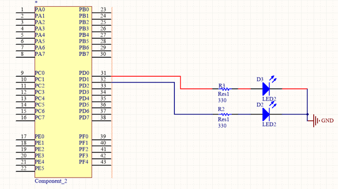
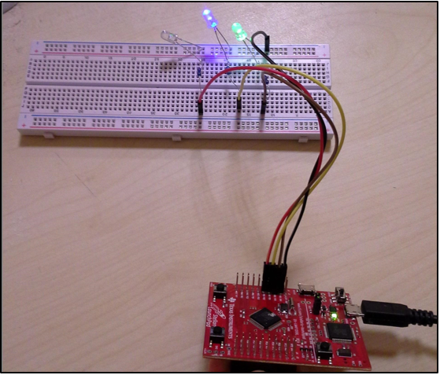

= Port D’nin dışarıdan led bağlanarak kullanılması

PD0 ve PD1’e birer led bağlı. +

[source,c]
---------------------------------------------------------------------

#include <stdint.h>
#include "inc/tm4c123gh6pm.h"
// stellaris #include "inc/lm4f120h5qr.h"

void init_port_D() {
	volatile unsigned long delay;
	SYSCTL_RCGC2_R |= SYSCTL_RCGC2_GPIOD; // Port D’yi aktiflestir
	delay = SYSCTL_RCGC2_R;  	// zaman gecirmek icin
	GPIO_PORTD_DIR_R |= 0x0F;	// PD 3,2,1,0 pinlerini cikis yap
	GPIO_PORTD_AFSEL_R &= ~0x0F; // PD 3,2,1,0 pinlerini alternatif fonksinunu 0 yap
	GPIO_PORTD_DEN_R |= 0x0F;	// PD 3,2,1,0 pinlerini aktiflestir
}

int main() {
	volatile unsigned long delay;

	init_port_D();

	while (1) {
   	GPIO_PORTD_DATA_R |= 0b0010; // PD1’i 1 yap
   	GPIO_PORTD_DATA_R &= ~0b0001; // PD0’i 0 yap

   	for (delay = 0 ; delay < 400000 ; delay++)
       		/* bos dongu */;

   	GPIO_PORTD_DATA_R |= 0b0001; // PD0’i 1 yap
   	GPIO_PORTD_DATA_R &= ~0b0010; // PD1’i 0 yap

   	for (delay = 0 ; delay < 400000 ; delay++)
       		/* bos dongu */;
	}
}

---------------------------------------------------------------------

= 3 Led ile Trafik Işığı

PD0’e kırmızı, PD1’e sarı (şekilde mavi led), PD2’ye yeşil led bağlı. +

[source,c]
---------------------------------------------------------------------

#include <stdint.h>
#include "inc/tm4c123gh6pm.h"
// stellaris #include "inc/lm4f120h5qr.h"

void init_port_D() {
	volatile unsigned long delay;
	SYSCTL_RCGC2_R |= SYSCTL_RCGC2_GPIOD; // Port D’yi aktiflestir
	delay = SYSCTL_RCGC2_R;  	// zaman gecirmek icin
	GPIO_PORTD_DIR_R |= 0x0F;	// PD 3,2,1,0 pinlerini cikis yap
	GPIO_PORTD_AFSEL_R &= ~0x0F; // PD 3,2,1,0 pinlerini alternatif fonksinunu 0 yap
	GPIO_PORTD_DEN_R |= 0x0F;	// PD 3,2,1,0 pinlerini aktiflestir
}

#define BIT_SET(PORT, PIN) do { \
	PORT |= 1<<PIN; \
} while (0)

#define BIT_RESET(PORT, PIN) do { \
	PORT &= ~(1<<PIN); \
} while (0)

#define PORTD (GPIO_PORTD_DATA_R)

int main() {
	volatile unsigned long delay;

	init_port_D();

	while (1) {
  	// KIRMIZI=1, SARI=0, YESIL=0
  	BIT_SET(PORTD, 1);
   	BIT_RESET(PORTD, 2);
   	BIT_RESET(PORTD, 3);
   	for (delay = 0 ; delay < 4000000 ; delay++)
  		 /* bos dongu */;

   	// KIRMIZI=1, SARI=1, YESIL=0
  	BIT_SET(PORTD, 1);
   	BIT_SET(PORTD, 2);
   	BIT_RESET(PORTD, 3);
  	for (delay = 0 ; delay < 4000000 ; delay++)
  		 /* bos dongu */;

  	// KIRMIZI=0, SARI=0, YESIL=1
  	BIT_RESET(PORTD, 1);
   	BIT_RESET(PORTD, 2);
   	BIT_SET(PORTD, 3);
  	for (delay = 0 ; delay < 4000000 ; delay++)
  		 /* bos dongu */;

  	// SARI
  	BIT_RESET(PORTD, 1);
   	BIT_SET(PORTD, 2);
   	BIT_RESET(PORTD, 3);
  	 for (delay = 0 ; delay < 4000000 ; delay++)
  		 /* bos dongu */;

	}
}

---------------------------------------------------------------------

= PORTD’ye Dışardan Led Bağlama ve PORTF Butonları ile Kontrol Etme

[source,c]

---------------------------------------------------------------------

#include <stdint.h>
#include "inc/tm4c123gh6pm.h"

// stellaris #include "inc/lm4f120h5qr.h"

void init_port_D() {
	volatile unsigned long delay;
	SYSCTL_RCGC2_R |= SYSCTL_RCGC2_GPIOD; // Port D’yi aktiflestir
	delay = SYSCTL_RCGC2_R;  	// zaman gecirmek icin
	GPIO_PORTD_DIR_R |= 0x0F;	// PD 3,2,1,0 pinlerini cikis yap
	GPIO_PORTD_AFSEL_R &= ~0x0F; // PD 3,2,1,0 pinlerini alternatif fonksinunu 0 yap
	GPIO_PORTD_DEN_R |= 0x0F;	// PD 3,2,1,0 pinlerini aktiflestir
}

/**Bu fonksiyon portf’ye erişip müdahale edebilmemiz için gerekli ayarları yapıyor.*/
void init_port_F() {
   volatile unsigned long tmp; // bu degisken gecikme yapmak icin gerekli
   tmp = SYSCTL_RCGCGPIO_R;    	// allow time for clock to start
   SYSCTL_RCGCGPIO_R |= 0x00000020;  // 1) activate clock for Port F
   GPIO_PORTF_LOCK_R = 0x4C4F434B;   // 2) unlock GPIO Port F
   GPIO_PORTF_CR_R = 0x01;       	// allow changes to PF-0
   // only PF0 needs to be unlocked, other bits can't be locked
   GPIO_PORTF_DIR_R = 0x0E;      	// 5) PF4,PF0 in, PF3-1 out
   GPIO_PORTF_PUR_R = 0x11;      	// enable pull-up on PF0 and PF4
   GPIO_PORTF_DEN_R = 0x1F;      	// 7) enable digital I/O on PF4-0
}
int main(void) {
   init_port_D();
   init_port_F();

   volatile unsigned long delay; // compiler optimizasyonunu engellemek icin volatile kullandik
   int button_sag, button_sol;
   while (1) {
  	 // sagdaki button 0. bit, soldaki button 4. bit
  	 // button basiliyken 0, basili degilken 1 değerini alır.

 // sagdaki buttonun degerini oku, degiskene degerini ata
  	 button_sag = GPIO_PORTF_DATA_R & 0b00001;

 // soldaki buttonun degerini oku, degiskene degerini ata
  	 button_sol = GPIO_PORTF_DATA_R & 0b10000;
  if(button_sol == 0 && button_sag == 0)
  	  {
  		  GPIO_PORTD_DATA_R |= 0b01110; PD(1,2,3)’ü 1 yap
  	  }
  else if (button_sag == 0) { // buton basılı ise
  		
  		GPIO_PORTD_DATA_R |= 0b00010; // PD1’i 1 yap
  		GPIO_PORTD_DATA_R &= ~(0b0100); // PD2’i 0 yap
  		GPIO_PORTD_DATA_R &= ~(0b01000); // PD3’i 0 yap
  	 }
  else if (button_sol == 0) { // button basili ise 
  		GPIO_PORTD_DATA_R |= 0b00100; // PD2’i 1 yap
  		GPIO_PORTD_DATA_R &= ~(0b00010); // PD1’i 0 yap
  		GPIO_PORTD_DATA_R &= ~(0b01000); // PD3’i 0 yap
  	 }

  else {

  	         GPIO_PORTD_DATA_R &= ~(0b00100); // PD1’i 1 yap
  		GPIO_PORTD_DATA_R &= ~(0b00010);  // PD2’i 1 yap
  		GPIO_PORTD_DATA_R &= ~(0b01000);  // PD3’i 1 yap
  	 }
   }
}

---------------------------------------------------------------------	 

