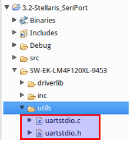
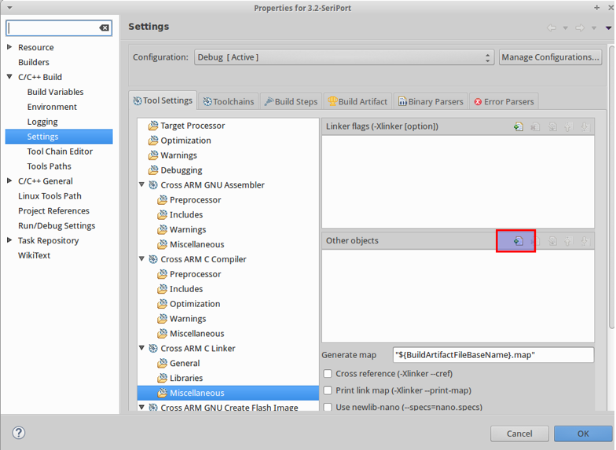
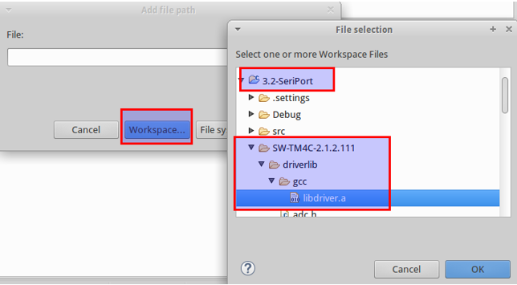
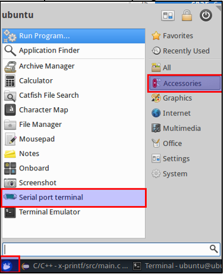
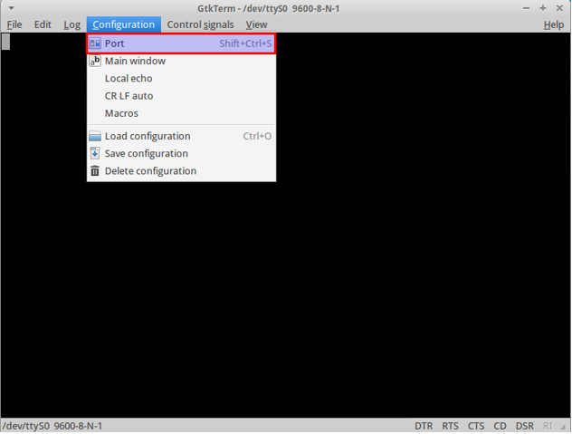
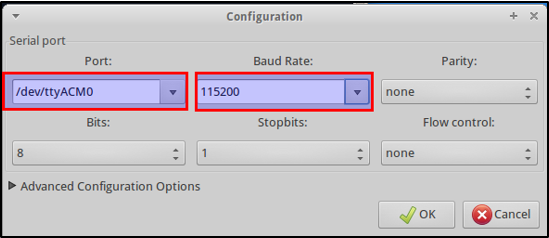
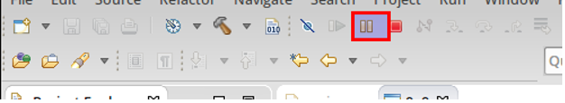
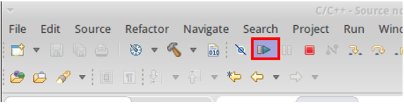

= ÖNEMLİ: Proje Dosyası Güncellemesi

07.03.2016 tarihinde hazır proje dosyalarında (Stellaris_Launchpad.tar.gz ve Tiva_C_Launchpad.tar.gz) güncelleme yapılmıştır. 
Son güncellemeyle proje klasörü altında utils/uartstdio.c ve utils/uartstdio.h dosyaları eklenmiştir. 

Eğer projenizde bu dosyalar bulunmuyorsa, hazır proje dosyalarının yeni versiyonunu “1_HAFTA_DOKUMAN3 ” altinda "1.2.Gerekli Dosyalar" bölümünden güncel kütüphaneleri indirebilirsiniz.

Güncelleme için: +

* yeni indirdiğiniz dosya ile yeni proje açabilirsiniz +
* veya hazır projeye sadece utils klasörünü yukarıdaki resimdeki gibi ekleyebilirsiniz +

Eğer projenizde bu dosyalar bulunmuyorsa, hazır proje dosyalarının yeni versiyonunu “01-Gelistirme_Ortami/proje_dosyalari” altindan indirebilirsiniz. +

= ÖNEMLİ: Proje Ayarları Güncellemesi

Proje isminde sağa tıklayarak açılan bölümde *“Properties”* e tıklayınız.

Açılan menüden C/C++ Build -> Settings menüsünü açınız. Aşağıdaki şekildeki gibi *“Cross ARM C Linker”*  altından *“Miscellaneous”*’u açınız. *“Other objects”* kısmındaki ekleme buttonuna tıklayınız. +

Açılan pencereden *“Workspace”* buttonuna tıklayıp, aşağıdaki resimdeki gibi açık olan projeniz altından *“...driverlib/gcc/libdriver.a”* dosyasını bulup ekleyiniz. +

= Seri porttan bilgisayara text gönderme ve okuma
Seri portu şimdilik log atmak için kullanacağımız için fazla detaya girmiyoruz. Aşağıdaki kod ile bilgisayara yazı gönderebilirsiniz. +

[source,c]
---------------------------------------------------------------------

#include <stdint.h>
#include "inc/tm4c123gh6pm.h"
// stellaris #include "inc/lm4f120h5qr.h"
	
#include <stdbool.h>
#include "inc/hw_types.h"
#include "driverlib/gpio.h"
#include "driverlib/sysctl.h"
#include "driverlib/uart.h"
#include "utils/uartstdio.h"

// secenekler: 300, 600, 1200, 2400, 4800, 9600, 19200, 38400, 57600, 115200
#define BAUDRATE 600

/** UART (seri port) ayarini yapan fonksiyon */
void init_UARTstdio() {
	SysCtlPeripheralEnable(SYSCTL_PERIPH_GPIOA);
	GPIOPinConfigure(0x00000001);
	GPIOPinConfigure(0x00000401);
	GPIOPinTypeUART(0x40004000, 0x00000001 | 0x00000002);
	UARTConfigSetExpClk(0x40004000, SysCtlClockGet(), BAUDRATE,
                        	(UART_CONFIG_WLEN_8 | UART_CONFIG_STOP_ONE |
                         	UART_CONFIG_PAR_NONE));
	UARTStdioConfig(0, BAUDRATE, SysCtlClockGet());
}

int main(void) {
	int i;

	init_UARTstdio();

	for (i = 0 ; ; i++) {
   	 UARTprintf("test: %d\n", i);
	}
}

---------------------------------------------------------------------

*“Undefined reference to ...”* hatasının alınması =
*“ÖNEMLİ: Proje Dosyası Güncellemesi”* veya *“ÖNEMLİ: Proje Ayarları Güncellemesi”* başlığındaki işlemlerde hata yapılmış olabilir. +

== Sanal makineden seri porta erişmek için aşağıdaki işlemleri yapabilirsiniz:

Önceki başlıktaki kodları derleyip, kartta çalıştırınız. +

*“Serial port terminal”* programını açınız +

Configuration menüsünden Port seçeneğini açınız +

Ayarları aşağıdaki gibi yapınız. +

*UYARI:* Baud Rate kısmına kodun içindeki *“#define BAUDRATE 600”* satırındaki değeri (600) girin. + 

Port kısmında seçeneklerde /dev/ttyACM1 gibi görünebilir. /dev/ttyACM ile başlayan portu seçin. +

Karttaki program çalışır durumdaysa Serial port terminal ekranında +

deneme: 12345 +
deneme: 12346 +
...
gibi satırlar göreceksiniz. +

Eğer ekranda tuhaf yazılar görüyorsanız, birkaç kere programı duraklatıp, devam ettirmeyi deneyiniz +

Tuhaf yazılar duraklatmayla çözülmüyorsa, Serial port terminali durdurup, tekrar çalıştırınız. Çalıştırıken Baud Rate değerinin koddaki ile aynı olduğunu kontrol ediniz.

