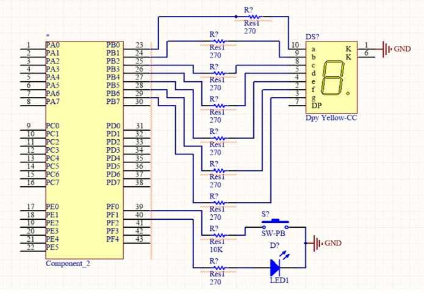

= Eş Zamanlı İşlem Problemi

Aşağıdaki iki işlem aynı anda yapılmak istenilmektedir. +

* seven segmente sayma işlemi yap +
* Buttona basıldığında ledi yak, basılmadığında söndür +

Aşağıdaki kodu çalıştırdıktan sonra buttona basılması ile ledin sönmesi arasındaki gecikmeyi test ediniz. +

İşlemci zamanını harcayarak yapılan bekleme işlemine “meşgul bekleme” (busy waiting) denilmektedir. +

Aşağıdaki örnekte meşgul bekleme durumu buttona basıldığında LED’in geç tepki vermesine, hatta bazı durumlarda algılanmamasına sebep olmaktadır. +

[source,c]
---------------------------------------------------------------------

#include <stdint.h>
#include "inc/tm4c123gh6pm.h"
// stellaris icin: #include "inc/lm4f120h5qr.h"

void init_port_F() {
	volatile unsigned long tmp; // bu degisken gecikme yapmak icin gerekli
	SYSCTL_RCGCGPIO_R |= 0x00000020;  // 1) activate clock for Port F
	tmp = SYSCTL_RCGCGPIO_R;    	// allow time for clock to start
	GPIO_PORTF_LOCK_R = 0x4C4F434B;   // 2) unlock GPIO Port F
	GPIO_PORTF_CR_R = 0x1F;       	// allow changes to PF4-0
	// only PF0 needs to be unlocked, other bits can't be locked
	GPIO_PORTF_AMSEL_R = 0x00;    	// 3) disable analog on PF
	GPIO_PORTF_PCTL_R = 0x00000000;   // 4) PCTL GPIO on PF4-0
	GPIO_PORTF_DIR_R = 0x0E;      	// 5) PF4,PF0 in, PF3-1 out
	GPIO_PORTF_AFSEL_R = 0x00;    	// 6) disable alt funct on PF7-0
	GPIO_PORTF_PUR_R = 0x11;      	// enable pull-up on PF0 and PF4
	GPIO_PORTF_DEN_R = 0x1F;      	// 7) enable digital I/O on PF4-0
}

void init_port_B() {
   volatile unsigned long delay;
   SYSCTL_RCGC2_R |= SYSCTL_RCGC2_GPIOB;
   delay = SYSCTL_RCGC2_R;
   GPIO_PORTB_DIR_R |= 0xFF; // 0xff == 0b11111111, hepsini cikis olarak ayarla
   GPIO_PORTB_AFSEL_R &= ~0xFF; // alternatif fonksiyo kapali
   GPIO_PORTB_DEN_R |= 0xFF; // hepsi aktif
}

// 0-9 arasindaki sayilarin g,f,e,d,c,b,a sirasiyla 7-segment kodlari
uint8_t kodlar[] = {
	~0b00111111,
	~0b00000110,
	~0b01011011,
	~0b01001111,
	~0b01100110,
	~0b01101101,
	~0b01111101,
	~0b00000111,
	~0b01111111,
	~0b01101111
};

volatile int sayi = 0;

// seven segmentte aralarda bekleyerek 0'dan 9'a say
void islem_1() {
	volatile unsigned long delay;
	GPIO_PORTB_DATA_R = kodlar[sayi];
	for (delay = 0 ; delay < 2000000 ; delay++)
    	/* */;
	sayi = (sayi + 1) % 10;
}

// button basiliysa ledi yak, degilse sondur
void islem_2() {
      int button;
      button=GPIO_PORTF_DATA_R & 0b00001;

  	 if (button == 0) {
  		 GPIO_PORTF_DATA_R |= 0b00100;
  	 } else {
  		 GPIO_PORTF_DATA_R &= ~0b00100;
  	 }
}

int main() {
	volatile unsigned long delay;

	init_port_B();
	init_port_F();

	// surekli islem_1 ve islem_2'yi yap
	while (1) {
    	islem_1();
    	islem_2();
	}
}

---------------------------------------------------------------------

