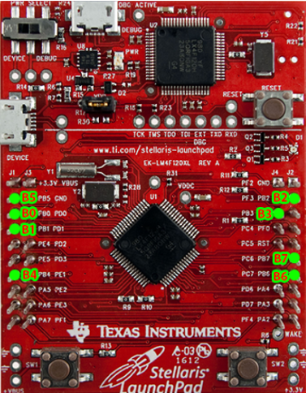
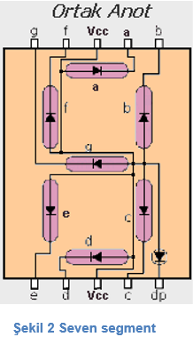
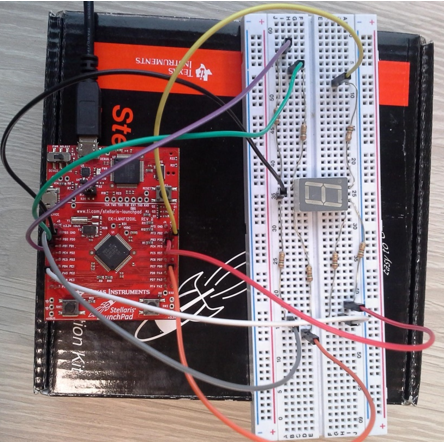

= Port B ile seven-segment kullanımı

Stellaris launchpad üzerinde PORT B’ye bağlı 8 tane pin vardır. Şekil 1’deki yeşil nokta ile işaretlenmiş pinler PORT B’nin pinlerdir.+

Ortak anot ve ortak katot olmak üzere 2 çeşit seven segment vardır. Bunların pin dizilimlerine ve seven segment hakkında detaylı bilgiye  aşağıdaki linkten ulaşabilirsiniz.
http://320volt.com/7-segment-led-display-nedir-nasil-kullanilir/ +

Ortak anot seven segment bağlantısı aşağıdaki gibi yapılmalıdır : +

PB0 -> a +
PB1 -> b +
PB2 -> c +
PB3 -> d +
PB4 -> e + 
PB5 -> f +
PB6 -> g +
+3.3V -> Vcc +

*Şekil 1* ++

++

*Şekil 3*+

Şekil 3’te yukarıda belirtilen  bağlantıların yapılmış hali gösterilmektedir. Vcc hariç diğer pinlere birer direnç(330Ω) bağladıktan sonra  stellaris launchpad üzerindeki PORT B’ye bağlanmıştır. +
Bağlantılar yapıldıktan sonra aşağıdaki kod parçası stellaris kartına yüklendiğinde seven segment üzerinde 0’dan 9’a kadar tüm rakamlar sırayla gösterilecekler. +

*Şekil 3*

[source,c]
---------------------------------------------------------------------

#include <stdint.h>
#include "inc/lm4f120h5qr.h"

void init_port_B() {
    volatile unsigned long delay;
    SYSCTL_RCGC2_R |= SYSCTL_RCGC2_GPIOB;
    delay = SYSCTL_RCGC2_R;
    GPIO_PORTB_DIR_R |= 0xFF; // 0xff == 0b11111111, hepsini cikis olarak ayarla
    GPIO_PORTB_AFSEL_R &= ~0xFF; // alternatif fonksiyo kapali
    GPIO_PORTB_DEN_R |= 0xFF; // hepsi aktif
}

// 0'dan 9'a kadar olan sayilarin seven segment kodlari
// bit sirasi: g f e d c b a
uint8_t kodlar[10] = {
    ~0b0111111,
    ~0b0000110,
    ~0b1011011,
    ~0b1001111,
    ~0b1100110,
    ~0b1101101,
    ~0b1111101,
    ~0b0000111,
    ~0b1111111,
    ~0b1101111
};

int main() {
    volatile unsigned long delay;

    init_port_B();

    int sayi = 0;

    while (1) {
   	 GPIO_PORTB_DATA_R = kodlar[sayi];
   	 for (delay = 0 ; delay < 1000000 ; delay++)
   		 /* */;
   	 sayi = (sayi + 1) % 10;
    }
}

#include <stdint.h>
#include "inc/lm4f120h5qr.h"

void init_port_B() {
    volatile unsigned long delay;
    SYSCTL_RCGC2_R |= SYSCTL_RCGC2_GPIOB;
    delay = SYSCTL_RCGC2_R;
    GPIO_PORTB_DIR_R |= 0xFF; // 0xff == 0b11111111, hepsini cikis olarak ayarla
    GPIO_PORTB_AFSEL_R &= ~0xFF; // alternatif fonksiyo kapali
    GPIO_PORTB_DEN_R |= 0xFF; // hepsi aktif
}

// 0'dan 9'a kadar olan sayilarin seven segment kodlari
// bit sirasi: g f e d c b a
uint8_t kodlar[10] = {
    ~0b0111111,
    ~0b0000110,
    ~0b1011011,
    ~0b1001111,
    ~0b1100110,
    ~0b1101101,
    ~0b1111101,
    ~0b0000111,
    ~0b1111111,
    ~0b1101111
};

int main() {
    volatile unsigned long delay;

    init_port_B();

    int sayi = 0;

    while (1) {
   	 GPIO_PORTB_DATA_R = kodlar[sayi];
   	 for (delay = 0 ; delay < 1000000 ; delay++)
   		 /* */;
   	 sayi = (sayi + 1) % 10;
    }
}

---------------------------------------------------------------------
