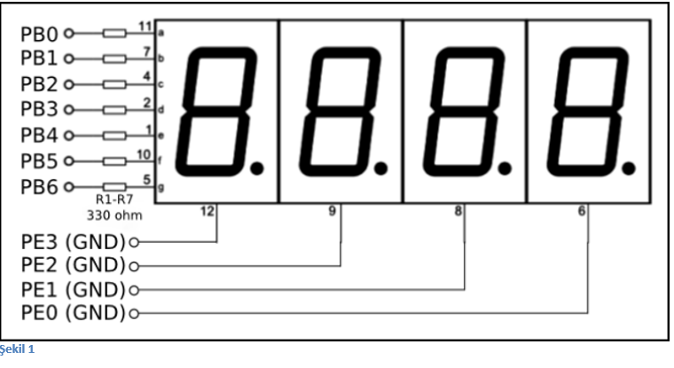

=Dörtlü Seven Segment

Dörtlü 7-segmentte sayı yazmayı sağlayan program. (Timer kullanmadan) +

Seven segment için gerekli bağlantılar Şekil 1’de gösterilmiştir. 
Bu bağlantıları yaptıktan sonra aşağıdaki kod parçasını stellaris kartına yükleyiniz ve seven segmentte görmek istediğiniz sayıyı kod parçasındaki “sayi“ değişkenine atayınız +

[source,c]
---------------------------------------------------------------------

#include <stdint.h>
#include <stdbool.h>

#include "inc/tm4c123gh6pm.h"
// stellaris icin: #include "inc/lm4f120h5qr.h"

void init_port_B() {
	volatile unsigned long delay;
	SYSCTL_RCGC2_R |= SYSCTL_RCGC2_GPIOB;
	delay = SYSCTL_RCGC2_R;
	GPIO_PORTB_DIR_R |= 0xFF;
	GPIO_PORTB_AFSEL_R &= ~0xFF;
	GPIO_PORTB_DEN_R |= 0xFF;

}

void init_port_E() {
	volatile unsigned long delay;
	SYSCTL_RCGC2_R |= SYSCTL_RCGC2_GPIOE;
	delay = SYSCTL_RCGC2_R;
	GPIO_PORTE_DIR_R |= 0x0f;
	GPIO_PORTE_AFSEL_R &= ~0x0f;
	GPIO_PORTE_DEN_R |= 0x0f;
}

// 0'dan 9'a kadar olan sayilarin seven segment kodlari
// bit sirasi: g f e d c b a
uint8_t kodlar[10] = {
	0b0111111,
	0b0000110,
	0b1011011,
	0b1001111,
	0b1100110,
	0b1101101,
	0b1111101,
	0b0000111,
	0b1111111,
	0b1101111
};

int main() {
   volatile unsigned long delay;

   init_port_B();
   init_port_E();

   int sayi = 1234;

   const int BEKLEME_LIMIT = 10000;

   while (1) {
       int birler = sayi % 10;
       GPIO_PORTE_DATA_R |= 0b1111; // hepsini kapat
       GPIO_PORTB_DATA_R = kodlar[birler];
       GPIO_PORTE_DATA_R &= ~0b0001; // birler basamagini aktiflestir
       for (delay = 0 ; delay < BEKLEME_LIMIT ; delay++)
           /* bekle */;

       int onlar = (sayi / 10) % 10;
       GPIO_PORTE_DATA_R |= 0b1111; // hepsini kapat
       GPIO_PORTB_DATA_R = kodlar[onlar];
       GPIO_PORTE_DATA_R &= ~0b0010; // onlar basamagini aktiflestir
       for (delay = 0 ; delay < BEKLEME_LIMIT ; delay++)
           /* bekle */;

       int yuzler = (sayi / 100) % 10;
       GPIO_PORTE_DATA_R |= 0b1111; // hepsini kapat
       GPIO_PORTB_DATA_R = kodlar[yuzler];
       GPIO_PORTE_DATA_R &= ~0b0100; // yuzler basamagini aktiflestir
       for (delay = 0 ; delay < BEKLEME_LIMIT ; delay++)
           /* bekle */;

       int binler = (sayi / 1000) % 10;
       GPIO_PORTE_DATA_R |= 0b1111; // hepsini kapat
       GPIO_PORTB_DATA_R = kodlar[binler];
       GPIO_PORTE_DATA_R &= ~0b1000; // binler basamagini aktiflestir

       for (delay = 0 ; delay < BEKLEME_LIMIT ; delay++)
           /* bekle */;
   }
}

---------------------------------------------------------------------
