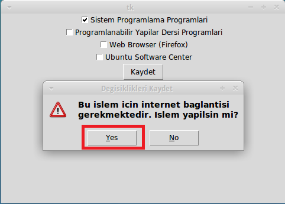

= 1. Sistem programlama dersine yönelik program kurulumu

* İçindekiler 

. Sistem programlama dersine yönelik program kurulumu 
. İçindekiler
.. Giriş
...  KOU Paket Yükleyici Programı

*Giriş* +
Sistem Programlama için kullanılacak geliştirme programlarının kurulumu ve ayarlananması anlatılacaktır.

*KOU Paket Yükleyici Programı*

VirtualBox ‘ın içine “xubuntu-kouembedded-v20160217.ova” isimli sanal makine kalıbı aktarıldıktan sonra masaüstünde KOU Paket Yükleyici isimli bir program görünecektir. 

image::resim1.2.png[R]

Masaüstündeki”Kou Paket Yükleyici”ye tıklayınız. +

”Sistem Programlama Programları”nı seçiniz ve “Kaydet”e tıklıyanız. +

image::resim1.2.2.png[R]

“Yes”e tıklayınız.

image::resim1.2.3.png[R]

password = 1 tane boşluk karakteri (space) +

  

